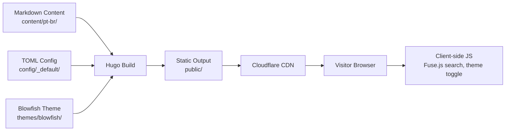

## Data Flow & Integrations

As a Hugo static site, the EF-TECH website has a build-time data flow rather than a runtime one. Data enters the system as Markdown content and TOML configuration, is processed by Hugo's build pipeline, and exits as static HTML/CSS/JS/JSON files served by a CDN. There are no databases, message queues, or runtime API calls. Client-side interactions (search, theme toggle) operate entirely in the browser using pre-built JSON indices.

## Module Dependencies

- **config/_default/** → consumed by Hugo build engine
- **content/pt-br/** → consumed by Hugo templates (from Blowfish theme)
- **themes/blowfish/** → provides layouts, partials, and assets to Hugo build
- **assets/img/** → processed by Hugo Pipes for image optimisation
- **static/** → copied verbatim to `public/`
- **archetypes/** → used by `hugo new` for content scaffolding
- **.github/workflows/** → triggers Hugo build in CI/CD

## Service Layer

There is no service layer in the traditional sense. Hugo's build pipeline acts as the sole "service":

- **Hugo Build Engine** — Processes content + config + theme into static output
- **Hugo Pipes** — Processes and optimises images from `assets/`
- **Hugo Taxonomies** — Generates tag, category, author, and series pages from front matter
- **Hugo Outputs** — Produces HTML, RSS (`index.xml`), and JSON (`index.json`) from templates

## High-level Flow

Build pipeline:

1. Developer writes Markdown in `content/pt-br/` with TOML front matter
2. Developer configures site behaviour in `config/_default/*.toml`
3. On push to `main`, Cloudflare Pages or GitHub Actions runs `hugo --gc --minify`
4. Hugo reads content, applies Blowfish theme templates, processes images via Hugo Pipes
5. Hugo outputs static files to `public/` (HTML, CSS, JS, JSON, XML, images)
6. CDN serves `public/` to visitors
7. Visitor browser runs Blowfish's client-side JS for search (Fuse.js), theme switching, and UI interactions

## Internal Movement

Hugo's build pipeline processes content through several stages:

1. **Content reading** — Hugo reads Markdown files from `content/pt-br/`, parses TOML front matter
2. **Template matching** — Hugo matches content to Blowfish theme layouts based on content type and front matter
3. **Asset processing** — Hugo Pipes processes images in `assets/` (resizing, format conversion, fingerprinting)
4. **Taxonomy generation** — Hugo creates taxonomy pages from front matter tags, categories, authors, series
5. **Output generation** — Hugo writes HTML, RSS, JSON, and sitemap to `public/`
6. **Post-processing** — `--gc` runs garbage collection on resources, `--minify` compresses HTML/CSS/JS

## External Integrations

- **Cloudflare Pages**
  - Purpose: Primary hosting and CDN delivery
  - Build: `hugo --gc --minify`
  - Output: `public/`
  - Env: `HUGO_VERSION=0.163.3`, production branch: `main`
  - Trigger: Git push webhook

- **GitHub Pages** (secondary)
  - Purpose: Alternative hosting via GitHub Actions
  - Workflow: `.github/workflows/pages.yml`
  - Steps: Install Hugo CLI → checkout (with submodules) → build → upload artifact → deploy
  - Trigger: Push to `main` or manual `workflow_dispatch`

- **GitHub Actions CI** (`.github/workflows/ci.yml`)
  - Purpose: Build validation and link checking on PRs
  - Steps: checkout (with submodules) → setup Hugo → build → lychee link check
  - Trigger: Pull request

- **GLPI** (`glpi.eftech.com.br`)
  - Purpose: External support ticketing portal
  - Integration: Footer menu link only (no API integration)

## Observability & Failure Modes

- **CI build failures**: GitHub Actions CI workflow runs on every PR — Hugo build errors or broken links (lychee) will block merges
- **Deploy failures**: Cloudflare Pages and GitHub Pages both report build failures via their respective dashboards
- **Broken links**: lychee checks all links in generated HTML during CI — fails the build if broken links are found
- **Theme submodule issues**: If `themes/blowfish/` is not initialised (missing `--recurse-submodules`), Hugo build will fail
- **Hugo version mismatch**: Build environment must use v0.163.3 to match local development and avoid feature/version incompatibilities
