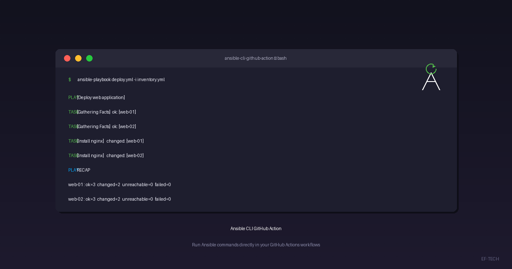

EF-TECH is proud to announce **ansible-cli-github-action**, a lightweight GitHub Action that brings the full power of Ansible CLI into your GitHub Actions workflows. Whether you need to run playbooks, manage Galaxy roles, or execute ad-hoc commands, this action has you covered.



## What Is It?

The action is based on the `python:3.11-slim` Docker image and comes pre-configured with:

- **Ansible** and all related CLI tools (`ansible`, `ansible-playbook`, `ansible-galaxy`, `ansible-inventory`, etc.)
- **pywinrm with CredSSP** support — ready to manage Windows hosts over WinRM out of the box
- **A full shell environment** — you can also run standard Linux commands at any step

No extra setup, no Python virtual environments, no dependency installation. Just point, configure, and run.

## Usage

The action has a single input — `command` — which accepts any Ansible or shell command you want to execute.

```yaml
- uses: eftechcombr/ansible-cli-github-action@master
  with:
    command: "ansible-playbook site.yml -i inventory.yml"
```

## Real-World Examples

### 1. Windows Connectivity Check via WinRM

Manage Windows servers without SSH. The `pywinrm[credssp]` package is pre-installed.

**Inventory (`inventory.ini`):**
```ini
[windows]
windows-server-01.example.com

[windows:vars]
ansible_connection=winrm
ansible_winrm_transport=ntlm
ansible_user=Administrator
ansible_password={{ windows_admin_password }}
ansible_winrm_server_cert_validation=ignore
```

**Workflow (`.github/workflows/windows-check.yml`):**
```yaml
name: Windows Connectivity Check

on:
  schedule:
    - cron: "0 6 * * *"
  workflow_dispatch:

jobs:
  winrm-ping:
    runs-on: ubuntu-latest
    steps:
      - uses: actions/checkout@v4

      - name: Run WinRM ping playbook
        uses: eftechcombr/ansible-cli-github-action@master
        with:
          command: >
            ansible-playbook win-ping.yml
            -i inventory.ini
            -e windows_admin_password=${{ secrets.WINDOWS_ADMIN_PASSWORD }}
```

### 2. Linux Connectivity Check via SSH

Connect to any Linux target over standard SSH.

**Inventory (`inventory.yml`):**
```yaml
all:
  hosts:
    web-01.example.com:
    web-02.example.com:
  vars:
    ansible_connection: ssh
    ansible_user: ubuntu
    ansible_ssh_private_key_file: /tmp/ssh_key
```

**Workflow with ad-hoc command:**
```yaml
name: Linux Connectivity Check

on:
  push:
    branches: [main]
  workflow_dispatch:

jobs:
  ssh-ping:
    runs-on: ubuntu-latest
    steps:
      - uses: actions/checkout@v4

      - name: Install SSH key
        run: |
          mkdir -p /tmp
          echo "${{ secrets.SSH_PRIVATE_KEY }}" > /tmp/ssh_key
          chmod 600 /tmp/ssh_key

      - name: Run playbook
        uses: eftechcombr/ansible-cli-github-action@master
        with:
          command: >
            ansible-playbook ping.yml
            -i inventory.yml

      - name: Ad-hoc ping test
        uses: eftechcombr/ansible-cli-github-action@master
        with:
          command: ansible all -i inventory.yml -m ping
```

### 3. Internal Network Access via Self-Hosted Runner

For targets inside private networks, use a self-hosted runner. Since the action is Docker-based, the runner only needs Docker — not Ansible or Python.

```yaml
jobs:
  health-check:
    runs-on: [self-hosted, linux, production]
    steps:
      - uses: actions/checkout@v4

      - name: Run health check playbook
        uses: eftechcombr/ansible-cli-github-action@master
        with:
          command: >
            ansible-playbook health-check.yml
            -i inventory.yml
```

## Why We Built This

At EF-TECH, we manage infrastructure across Windows and Linux environments for our clients. We needed a simple, repeatable way to run Ansible commands inside GitHub Actions without:

- Installing Ansible and its dependencies on every runner
- Managing Python virtual environments in CI
- Debugging environment inconsistencies between runs

The result is a Docker image that encapsulates everything Ansible needs — and a GitHub Action that wraps it in a single `uses:` directive.

## Testing

The image includes a smoke test suite you can run locally:

```bash
tests/smoke_build.sh \
  && tests/smoke_ansible.sh \
  && tests/smoke_python.sh \
  && tests/smoke_shell.sh \
  && tests/smoke_playbook.sh
```

These tests verify:
- Docker image build
- Ansible CLI version checks (`ansible`, `ansible-playbook`, `ansible-inventory`)
- Python dependency imports (`winrm`, `ansible`)
- Shell command passthrough and exit code propagation
- Playbook syntax checking and localhost execution

## Get Started

The action is **open-source** under the MIT license and is available on GitHub:

🔗 [https://github.com/eftechcombr/ansible-cli-github-action](https://github.com/eftechcombr/ansible-cli-github-action)

To use it in your project:

1. Add a workflow file in `.github/workflows/`
2. Check out your repository with `actions/checkout@v4`
3. Add a step using `eftechcombr/ansible-cli-github-action@master`
4. Set the `command` input to your desired Ansible command

## Useful Links

- [GitHub Repository](https://github.com/eftechcombr/ansible-cli-github-action)
- [Ansible Documentation](https://docs.ansible.com/)
- [GitHub Actions Documentation](https://docs.github.com/en/actions)
- [Ansible Windows WinRM Guide](https://docs.ansible.com/ansible/latest/os_guide/windows_winrm.html)

---

At **EF-TECH**, we specialize in cloud computing, IT infrastructure automation, and DevOps practices. We offer expert support for Ansible, GitHub Actions, and infrastructure-as-code solutions. [Contact us](/en/contato/) to learn how we can help your team.
