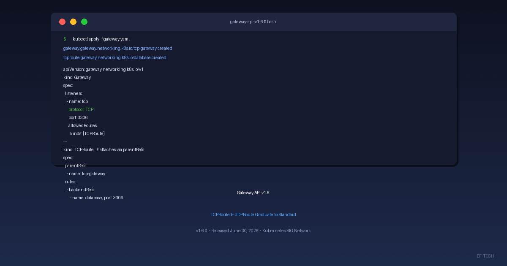

The Kubernetes SIG Network community released **Gateway API v1.6.0** on June 30, 2026, and it is a milestone release: **TCPRoute and UDPRoute graduate from Experimental to Standard (GA)** in the `v1` API version. For the first time, you can route raw TCP and UDP traffic through Gateway API with a portable, vendor-neutral API — no more falling back to a plain `Service` or to implementation-specific CRDs.



## What's New in Gateway API v1.6

- **TCPRoute and UDPRoute are now Standard** (`v1`), enabling portable raw L4 traffic routing.
- **A new experimental resource, XBackend**, arrives in the `gateway.networking.x-k8s.io/v1alpha1` group as a general-purpose decorator for backends.
- **Experimental APIs get their own group**: new experimental resources live under `gateway.networking.x-k8s.io` with an `X` prefix, instead of the old version-string scheme.
- **Six implementations are conformant with v1.6** on the day of the announcement.

## TCPRoute and UDPRoute Graduate to Standard

Raw Layer 4 routing has been the most requested feature in Gateway API's history. Before v1.6, workloads that need protocol-level TCP or UDP traffic — databases, DNS, VoIP, gaming, IoT telemetry — had to rely on plain Kubernetes `Service` objects or on CRDs tied to a specific implementation.

With `TCPRoute` and `UDPRoute` in the `v1` API version, that changes. A `Gateway` declares a listener with `protocol: TCP` (or `UDP`) and an `allowedRoutes.kinds` list that includes the route type. The route attaches to the listener through `parentRefs` — with an optional `sectionName` and `port` — and forwards to a backend via `rules[].backendRefs`.

Here is what a TCP setup looks like:

```yaml
apiVersion: gateway.networking.k8s.io/v1
kind: Gateway
metadata:
  name: tcp-gateway
spec:
  gatewayClassName: example
  listeners:
    - name: tcp
      protocol: TCP
      port: 3306
      allowedRoutes:
        kinds:
          - group: gateway.networking.k8s.io
            kind: TCPRoute
---
apiVersion: gateway.networking.k8s.io/v1
kind: TCPRoute
metadata:
  name: database
spec:
  parentRefs:
    - name: tcp-gateway
      sectionName: tcp
      port: 3306
  rules:
    - backendRefs:
        - name: database
          port: 3306
```

`UDPRoute` follows exactly the same pattern — just swap `protocol: TCP` for `protocol: UDP` on the listener and use `kind: UDPRoute` (with a matching `allowedRoutes.kinds` entry) on the route.

**Deprecation note:** the `v1alpha2` versions of `TCPRoute` and `UDPRoute` are deprecated as of v1.6 and will be removed in a future release. Existing `v1alpha2` users should plan to migrate to `v1`.

## XBackend: A New Experimental Resource (GEP-4894)

Alongside the GA graduation, v1.6 introduces a new experimental API called **XBackend**, a general-purpose decorator for `Service` and other backend types. It lives in the new API group `gateway.networking.x-k8s.io/v1alpha1`.

The first version of `XBackend` supports `ExternalHostname` destinations — an Extended/Optional feature that is useful for egress scenarios and agentic AI workloads. Because an `ExternalHostname` resolves to an address outside the cluster, keep the *confused deputy* security consideration in mind: any controller that proxies to external hostnames should be explicit about which hostnames it is allowed to reach.

The community is also working on moving Session Persistence configuration from `XBackendTrafficPolicy` into `XBackend`, as well as adding support for retries and TLS origination.

## Experimental APIs Move to Their Own Group

v1.6 also changes *how* experimental APIs are versioned. New experimental resources now live in a separate API group, `gateway.networking.x-k8s.io`, and their type names carry an `X` prefix — for example `XBackend` and `XMesh`. When a resource graduates to Standard, it is renamed into `gateway.networking.k8s.io` and the `X` prefix is dropped (for example, `XMesh` becomes `Mesh`).

`TCPRoute` and `UDPRoute` were the last resources to graduate under the old version-string scheme (`v1alpha2` → `v1`). Going forward, the `X`-prefixed group makes it clear at a glance which resources are still experimental.

## Conformance: Six Implementations

Gateway API conformance is enforced through a formal test suite, and the following six implementations were conformant with v1.6 on publication day:

- Agentgateway
- Airlock Microgateway
- GKE Gateway
- kgateway
- NGINX Gateway Fabric
- Traefik Proxy

## Try It Yourself

If you want to try TCP or UDP routing today, any of the conformant implementations above is a good starting point. The project maintains user guides for [TCP](https://gateway-api.sigs.k8s.io/guides/user-guides/tcp/) and [UDP](https://gateway-api.sigs.k8s.io/guides/user-guides/udp/) routing, plus full [documentation](https://gateway-api.sigs.k8s.io/) and the [v1.6.0 release notes](https://github.com/kubernetes-sigs/gateway-api/releases/tag/v1.6.0).

## Get Involved

Gateway API is the role-oriented, expressive service networking standard for Kubernetes, built under SIG Network. To get involved:

- Join **#sig-network-gateway-api** on the [Kubernetes Slack](https://slack.k8s.io/)
- Check the SIG Network calendar for community meetings
- Browse and contribute to the [gateway-api repository](https://github.com/kubernetes-sigs/gateway-api)

---

At **EF-TECH**, we specialize in Kubernetes, cloud computing, and infrastructure automation. We help teams design and operate modern service networking — Gateway API included. [Contact us](/en/contato/) to learn how we can help your team. For more articles like this, visit our [blog](/en/blog/).
