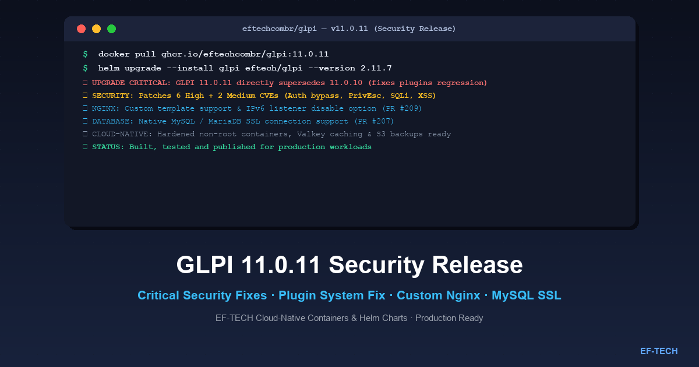

Today, October 1, 2026, EF-TECH released new Docker images and Helm charts for **GLPI 11.0.11** in the [eftechcombr/glpi](https://github.com/eftechcombr/glpi) repository. This update delivers critical upstream security patches, resolves an urgent regression in the plugin subsystem, and incorporates key operational improvements contributed by EF-TECH and open-source collaborators.



## Why GLPI 11.0.11 Supersedes Version 11.0.10

A critical detail for system operators and administrators: **GLPI 11.0.11 directly supersedes and replaces version 11.0.10**.

During the 11.0.10 release cycle, an unexpected regression was introduced that broke plugin loading and execution hooks. Because IT service desks and enterprise setups rely heavily on plugins for inventory synchronization, authentication, and workflow automation, the upstream `glpi-project/glpi` maintainers promptly released version 11.0.11 to rectify this issue alongside high-priority security fixes.

> **Upgrade Advisory:** If your organization was preparing to deploy version 11.0.10 or is currently running 11.0.9 (or earlier), upgrade directly to **GLPI 11.0.11**. Version 11.0.10 should not be deployed in production environments.

---

## Security Advisory: What Was Fixed

Officially classified as a **Security Release**, GLPI 11.0.11 fixes a set of severe vulnerabilities that could lead to unauthorized privilege escalation, database compromise, or authentication bypass.

### High-Severity Vulnerabilities (High)

1. **Authorization bypass in massive actions**:
   Flawed contextual permission checks during bulk item updates allowed operators to execute actions and modify resources outside their authorized scope.
2. **Privilege escalation via user cloning**:
   A vulnerability in the account cloning workflow allowed lower-privileged operators to inherit or grant administrative privileges during account duplication.
3. **Improper rights checks in users deletion**:
   Missing profile verification when purging or disabling accounts in the user directory.
4. **SQL Injection through form actors dropdown**:
   Insufficient sanitization of user-supplied HTTP parameters in the dynamic dropdown selector for form actors, creating a vector for unauthorized SQL queries.
5. **2FA deactivation/modification on users with higher privileges**:
   A flaw allowing accounts with standard permissions to modify or disable two-factor authentication (MFA/2FA) on accounts with superior administrative rights.
6. **Reflected XSS in the dashboard search result widget**:
   Arbitrary script execution in the browser of operators due to unsanitized search input rendered within the main dashboard widget.

### Medium-Severity Vulnerabilities (Medium)

- **Users names enumeration via the planning feature**:
  Information disclosure exposing operator logins and names through planning calendar responses.
- **Missing authorization checks in the planning feature**:
  Unauthorized viewing and interaction with third-party calendar entries and appointments.

Given that these vulnerabilities include SQL Injection, 2FA tampering, and privilege escalation, an immediate upgrade is strongly recommended for all production instances.

---

## What's New in the EF-TECH Distribution (`eftechcombr/glpi`)

Along with upgrading the base image to GLPI 11.0.11 (PR #211 by [@eduardofraga](https://github.com/eduardofraga)), EF-TECH's containerized distribution includes valuable architectural features:

### 1. Custom Nginx Configuration Template & IPv6 Control (PR #209)

Contributed by [@ohemelaar-dinum](https://github.com/ohemelaar-dinum), the project now supports supplying a custom Nginx configuration template (`nginx.conf.template`).

In enterprise environments and Kubernetes clusters where IPv6 is disabled in the host kernel, Nginx's default `listen [::]:80;` directive caused container startup failures:

```text
nginx: [emerg] bind() to [::]:80 failed (99: Cannot assign requested address)
```

With PR #209, operators can customize the Nginx server block or disable the IPv6 listener completely without building a custom image.

#### Example: Disabling the IPv6 Listener via Custom Template

When mounting a custom virtualhost template via ConfigMap or Docker volume:

```nginx
# custom-nginx.conf.template
server {
    listen 80 default_server;
    # IPv6 listener disabled for clusters without IPv6 support
    # listen [::]:80 default_server;

    server_name _;
    root /var/www/glpi/public;

    location / {
        try_files $uri /index.php$is_args$args;
    }

    location ~ ^/index\.php$ {
        fastcgi_pass ${GLPI_PHPFPM_HOST}:${GLPI_PHPFPM_PORT};
        fastcgi_split_path_info ^(.+\.php)(/.+)$;
        fastcgi_index index.php;
        include fastcgi_params;
        fastcgi_param SCRIPT_FILENAME $document_root$fastcgi_script_name;
    }
}
```

### 2. Native MySQL / MariaDB SSL/TLS Connection Support (PR #207)

Introduced during the recent release cycle and fully compatible with 11.0.11, the image supports encrypted database connections over SSL/TLS out of the box.

This capability is essential when connecting GLPI to managed cloud database services (such as **AWS RDS Aurora MySQL**, **Google Cloud SQL**, or **Azure Database for MySQL**), where encrypted transport (`REQUIRE SSL`) is mandatory.

Supported environment variables:
- `GLPI_DB_SSL`: Enable or disable SSL mode (`true` or `false`).
- `GLPI_DB_SSL_CA`: Path to the CA certificate bundle.
- `GLPI_DB_SSL_VERIFY`: Enforce strict database certificate verification.

---

## How to Upgrade or Get Started

### Upgrading via Helm Chart (Kubernetes)

The official EF-TECH Helm repository is updated with the latest release:

```bash
# 1. Add or update the EF-TECH Helm repository
helm repo add eftech https://eftechcombr.github.io/glpi/
helm repo update

# 2. Upgrade your deployment to GLPI 11.0.11
helm upgrade --install glpi eftech/glpi \
  --namespace glpi \
  --create-namespace \
  --version 2.11.7
```

### Standalone Docker / Docker Compose

For standalone container environments:

```bash
# Pull the stable 11.0.11 container image
docker pull ghcr.io/eftechcombr/glpi:11.0.11
```

Sample `docker-compose.yml` running GLPI 11.0.11 with MariaDB and Nginx:

```yaml
services:
  glpi-fpm:
    image: ghcr.io/eftechcombr/glpi:11.0.11
    restart: unless-stopped
    environment:
      - GLPI_DB_HOST=mariadb
      - GLPI_DB_NAME=glpi
      - GLPI_DB_USER=glpi
      - GLPI_DB_PASSWORD=secret_db_password
      - GLPI_DB_SSL=false
    volumes:
      - glpi_data:/var/www/glpi/files
      - glpi_marketplace:/var/www/glpi/marketplace

  glpi-nginx:
    image: ghcr.io/eftechcombr/glpi-nginx:11.0.11
    restart: unless-stopped
    ports:
      - "8080:80"
    environment:
      - GLPI_PHPFPM_HOST=glpi-fpm
      - GLPI_PHPFPM_PORT=9000
    depends_on:
      - glpi-fpm

volumes:
  glpi_data:
  glpi_marketplace:
```

---

## Links and References

- [eftechcombr/glpi GitHub Repository](https://github.com/eftechcombr/glpi)
- [eftechcombr/glpi Releases and Changelog](https://github.com/eftechcombr/glpi/releases)
- [Upstream GLPI 11.0.11 Release Notes](https://github.com/glpi-project/glpi/releases/tag/11.0.11)
- [GLPI on Artifact Hub](https://artifacthub.io/packages/helm/eftech/glpi)
- [EF-TECH Helm Charts Repository](https://eftechcombr.github.io/glpi/)

---

At **EF-TECH**, we specialize in Kubernetes, cloud computing, and infrastructure automation. We design, deploy, and operate high-performance GLPI platforms with enterprise-grade security, observability, and scalability. [Contact us](/en/contato/) to find out how we can support your organization. For more articles like this, visit our [blog](/en/blog/).
