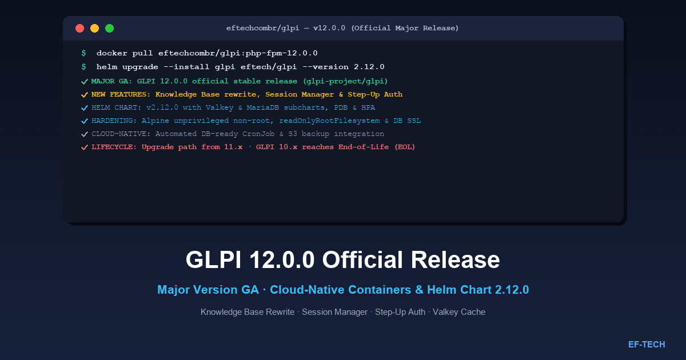

Today, October 9, 2026, **EF-TECH** is proud to announce the official release of version **v12.0.0** of its cloud-native GLPI distribution in the [eftechcombr/glpi](https://github.com/eftechcombr/glpi) repository (PR #214). This release follows the upstream General Availability (GA) publication of **GLPI 12.0.0** by the [glpi-project/glpi](https://github.com/glpi-project/glpi) team on October 7, 2026 — reaching full production stability after three rigorous Release Candidate test cycles (rc1, rc2, and rc3).

Alongside this milestone, we are releasing the new **Helm chart `glpi-2.12.0`** (with `appVersion: "12.0.0"`) on the official EF-TECH charts repository, along with production-grade container images **`eftechcombr/glpi:php-fpm-12.0.0`** and **`eftechcombr/glpi:nginx-12.0.0`**.



---

## What's New in Upstream GLPI 12.0.0

GLPI 12.0.0 represents a major leap forward for open-source IT Service Management (ITSM) and IT Asset Management (ITAM), pairing a modernized user experience with strengthened enterprise security and governance controls.

### 1. Complete Knowledge Base Rework

The Knowledge Base frontend has been redesigned from the ground up:
- Intuitive tree navigation and streamlined article categorization, drastically reducing ticket resolution time via user self-service portals.
- Fast, intelligent live search with enhanced keyword highlighting and relevant suggestions.
- Clean and responsive layout for standard operating procedures (SOP), technical guides, and FAQs.
- Revamped media, attachment, and code snippet rendering engine.

### 2. Active Session Management

To support stringent enterprise security standards and regulatory compliance (such as ISO 27001, SOC 2, and GDPR), GLPI 12 introduces centralized session monitoring:
- Complete visibility into active user sessions: originating IP address, user-agent / browser info, session start time, and last observed activity timestamp.
- Remote session revocation: administrators can immediately invalidate specific or all active sessions for a compromised account.
- Self-service inspection for technicians and end users to audit and terminate forgotten sessions across external workstations or mobile devices.

### 3. Step-Up Authentication and Sudo Mode

Sensitive administrative actions — such as altering profile permissions, performing bulk asset deletions, or updating external identity providers (LDAP, SAML, OAuth) — are now protected by **Sudo Mode / Step-Up Authentication**:
- Operators are prompted to re-authenticate (via password or secondary MFA factor) before executing sensitive administrative operations.
- This defense-in-depth mechanism ensures that active unattended browser tabs on administrative workstations cannot be hijacked or misused.

### 4. Group-Managed OLAs (Operational Level Agreements)

In advanced ITSM workflows, Operational Level Agreements (OLAs) define internal service-level targets between internal support teams:
- GLPI 12 introduces native support for multiple OLAs directly assigned to technician groups (e.g., networking, sysadmin, database, application support).
- Supports cascading deadlines and SLA escalation as tickets pass between different tiers and teams.

### 5. In-Depth Accessibility (RGAA & RAWeb)

This release marks the first comprehensive development cycle aligned with international accessibility guidelines (WCAG) as well as the French **RGAA** (Référentiel Général d'Amélioration de l'Accessibilité) and **RAWeb** standards:
- Full keyboard-only navigability across core ticket workflows, inventory management, and reporting dashboards.
- Balanced visual contrast ratios and native screen reader compatibility.

### 6. Core Security Hardening

The upstream codebase underwent a deep hardening cycle:
- Strengthened defenses against SQL injection (SQLi) and cross-site request forgery (CSRF).
- Strict typing and strict input validation across all internal service APIs and form processing endpoints.

### 7. Brand New User Documentation Portal

End-user and administrator guides have been rewritten and published at the official portal [help.glpi-project.org](https://help.glpi-project.org), featuring modern tutorials, visual workflows, and ITSM best practices.

### 8. End of Life (EOL) for GLPI 10.x

An essential lifecycle advisory for system administrators: **the GLPI 10.x release cycle has officially reached End-of-Life (EOL)**.
- **GLPI 10.0.28** serves as the final maintenance release of the 10.x series.
- Going forward, **no further bug fixes will be provided for GLPI 10**.
- Organizations running GLPI 10 should immediately plan their migration to supported versions (GLPI 11.x or GLPI 12.x).

---

## Key Features in EF-TECH's Cloud-Native Distribution

The [eftechcombr/glpi](https://github.com/eftechcombr/glpi) project packages GLPI specifically for Kubernetes and containerized production environments.

In release **12.0.0** and Helm chart **`glpi-2.12.0`**, highlights include:

| Feature | Technical Highlights |
|---|---|
| **Unprivileged (Non-Root) Images** | Lightweight Alpine-based containers running PHP-FPM and Nginx under unprivileged UID 10001 / GID 10001. |
| **Valkey Subchart (`helmforge/valkey`)** | Modern Valkey subchart replacing inline Redis, with full support for `externalCache` connecting to managed enterprise cache clusters. |
| **MariaDB Subchart (`helmforge/mariadb`)** | Decoupled database subchart with dynamic secret generation and support for `externalDatabase` with `existingSecret`. |
| **Custom Nginx Configuration Templates** | Support for mounting custom `nginx.conf.template` files via ConfigMap (PR #209), allowing operators to disable the IPv6 listener in IPv4-only clusters. |
| **Database SSL/TLS Connections** | Native encrypted database connections (`GLPI_DB_SSL`, `GLPI_DB_SSL_CA`, `GLPI_DB_SSL_VERIFY`) compatible with AWS Aurora MySQL, Google Cloud SQL, and Azure Database for MySQL (PR #207). |
| **Enterprise High Availability (HA)** | Built-in PodDisruptionBudget (PDB) and HorizontalPodAutoscaler (HPA) to seamlessly handle service desk traffic spikes. |
| **Container Hardening** | Support for `readOnlyRootFilesystem`, `priorityClassName`, strict `securityContext`, and Bitnami-style resource presets (`resourcesPreset`). |
| **Operational Automation** | Automated maintenance CronJob (`bin/console glpi:cron`) conditioned on database readiness, and optional automated file backup CronJob targeting S3-compatible object storage. |

---

## How to Install or Upgrade

### 1. Kubernetes Deployment via Helm Chart

The EF-TECH Helm chart provides the recommended method for deploying GLPI on Kubernetes clusters.

#### Step 1: Add the EF-TECH Helm Repository

```bash
# Add or update the official EF-TECH Helm repository
helm repo add eftech https://eftechcombr.github.io/glpi/charts
helm repo update
```

#### Step 2: Configure `values.yaml`

Create a production-ready `values.yaml` configuration file:

```yaml
# values.yaml for GLPI 12.0.0 production deployment
replicaCount: 2

image:
  repository: eftechcombr/glpi
  tag: "php-fpm-12.0.0"
  pullPolicy: IfNotPresent

nginx:
  enabled: true
  image:
    repository: eftechcombr/glpi
    tag: "nginx-12.0.0"
  resourcesPreset: "small"

autoscaling:
  enabled: true
  minReplicas: 2
  maxReplicas: 8
  targetCPUUtilizationPercentage: 75
  targetMemoryUtilizationPercentage: 80

podDisruptionBudget:
  enabled: true
  minAvailable: 1

securityContext:
  readOnlyRootFilesystem: true
  runAsNonRoot: true
  runAsUser: 10001

# Enable Valkey subchart for fast session handling and cache
valkey:
  enabled: true

# Enable MariaDB subchart for internal persistence
mariadb:
  enabled: true
  auth:
    database: glpi
    username: glpi

cron:
  enabled: true
  schedule: "*/5 * * * *"
```

#### Step 3: Run the Helm Upgrade/Install Command

```bash
helm upgrade --install glpi eftech/glpi \
  --namespace glpi \
  --create-namespace \
  --version 2.12.0 \
  -f values.yaml
```

---

### 2. Standalone Deployment with Docker Compose

For organizations operating standalone container environments on Docker engines or virtual machines:

```yaml
# docker-compose.yml
services:
  glpi-db:
    image: mariadb:11.4
    restart: unless-stopped
    environment:
      - MARIADB_ROOT_PASSWORD=your_secure_root_password
      - MARIADB_DATABASE=glpi
      - MARIADB_USER=glpi
      - MARIADB_PASSWORD=your_secure_glpi_password
    volumes:
      - db_data:/var/lib/mysql
    networks:
      - glpi-net

  glpi-cache:
    image: valkey/valkey:8.0-alpine
    restart: unless-stopped
    networks:
      - glpi-net

  glpi-fpm:
    image: eftechcombr/glpi:php-fpm-12.0.0
    restart: unless-stopped
    environment:
      - GLPI_DB_HOST=glpi-db
      - GLPI_DB_NAME=glpi
      - GLPI_DB_USER=glpi
      - GLPI_DB_PASSWORD=your_secure_glpi_password
      - GLPI_DB_SSL=false
    volumes:
      - glpi_files:/var/www/glpi/files
      - glpi_plugins:/var/www/glpi/marketplace
    depends_on:
      - glpi-db
      - glpi-cache
    networks:
      - glpi-net

  glpi-nginx:
    image: eftechcombr/glpi:nginx-12.0.0
    restart: unless-stopped
    ports:
      - "8080:80"
    environment:
      - GLPI_PHPFPM_HOST=glpi-fpm
      - GLPI_PHPFPM_PORT=9000
    depends_on:
      - glpi-fpm
    networks:
      - glpi-net

volumes:
  db_data:
  glpi_files:
  glpi_plugins:

networks:
  glpi-net:
    driver: bridge
```

Start the stack with:

```bash
docker compose up -d
```

---

## Migration Guide: Moving from GLPI 10.x / 11.x to GLPI 12.0.0

Upgrading to a major release requires deliberate planning to ensure business continuity:

1. **Mandatory Full Backups:**
   - Create a consistent snapshot of your MariaDB/MySQL database (`mysqldump --single-transaction --quick glpi > backup_glpi_pre12.sql`).
   - Back up the entire GLPI persistent files directory (`/var/www/glpi/files/`).
2. **Review Plugin Compatibility:**
   - Because GLPI 12 features overhauled UI components and rewritten Knowledge Base internals, check that any installed plugins are officially certified for GLPI 12 on the GLPI Marketplace.
3. **Execute Database Schema Migration:**
   - When deploying via container, the entrypoint validates and triggers the update automatically. Alternatively, run the CLI tool:
     ```bash
     php bin/console db:update
     ```
4. **Cache Invalidation:**
   - Flush and regenerate the application cache after schema updates:
     ```bash
     php bin/console cache:clear
     ```

---

## Official Links and References

- [eftechcombr/glpi GitHub Repository](https://github.com/eftechcombr/glpi)
- [eftechcombr/glpi Releases and Changelog](https://github.com/eftechcombr/glpi/releases)
- [Official EF-TECH Helm Charts Repository](https://eftechcombr.github.io/glpi/)
- [GLPI on Artifact Hub](https://artifacthub.io/packages/helm/eftech/glpi)
- [Upstream GLPI 12.0.0 Release Notes](https://github.com/glpi-project/glpi/releases/tag/12.0.0)
- [GLPI User Help Documentation](https://help.glpi-project.org)

---

**EF-TECH** specializes in enterprise cloud architecture, Kubernetes, and Site Reliability Engineering (SRE). We design, migrate, and support mission-critical GLPI deployments with enterprise-grade high availability, security hardening, and GitOps automation.

Looking to upgrade your GLPI environment or deploy on enterprise Kubernetes? [Contact us](/en/contato/) to speak with our cloud engineers. Learn more about our [GLPI enterprise solution](/en/produtos/glpi/) and explore additional technical articles on our [blog](/en/blog/).
