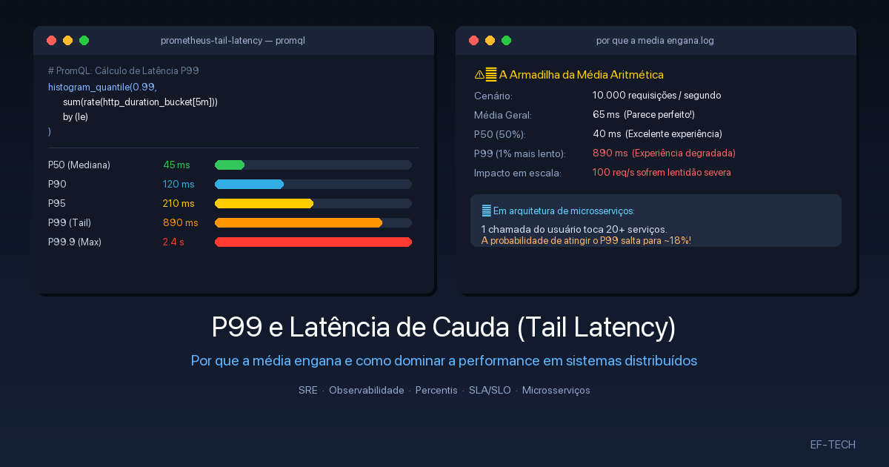

In large-scale systems and modern microservice architectures, one of the most common engineering pitfalls is relying on the **arithmetic mean (average)** to evaluate application health and response times.

Stating that *"our API average response time is 60ms"* may sound comforting in executive status updates. However, lurking behind that seemingly pristine number, hundreds or thousands of users might be suffering from 3-to-10-second freezes, abandoning checkout carts, or triggering cascading timeouts across your backend.

This is where **percentiles** come in — specifically **P99 (the 99th Percentile)** and the phenomenon known as **Tail Latency**.

In this in-depth guide, we will explore the foundational statistical concepts, demystify why averages are misleading, demonstrate how microservice fan-out amplifies tail latency, and analyze root causes and battle-tested mitigation strategies used by leading SRE and performance engineering teams.



---

## 1. What Is a Percentile and How Does It Work?

A **percentile** (or quantile) is a statistical measure indicating the value below which a given percentage of observations in a dataset falls.

To calculate response time percentiles:
1. Collect all latency measurements over a specific time window (e.g., the last 5 minutes).
2. Sort all samples in ascending order from fastest to slowest.
3. Locate the value corresponding to the desired percentile rank.

```
Sorted samples (in ms): [ 12, 15, 18, 22, 25, ..., 180, 240, 890, 2400 ]
                           ▲                      ▲          ▲       ▲
                          P50                    P90        P95     P99
```

### Key Percentile Milestones in System Monitoring

| Metric | Name | Technical Meaning | Real-World Representation |
| :--- | :--- | :--- | :--- |
| **P50** | Median | 50% of requests were faster than this value; 50% were slower. | The experience of the **typical/average user**. |
| **P90** | 90th Percentile | 90% of requests were faster; 10% were slower. | The threshold where degradation begins. |
| **P95** | 95th Percentile | 95% of requests were faster; 5% were slower. | Standard baseline for **first-tier alerting** and intermediate SLOs. |
| **P99** | 99th Percentile | 99% of requests were faster; only **1%** was slower. | **The standard tail latency metric**. Measures near-worst-case experience. |
| **P99.9** | "Three Nines" | 99.9% of requests were faster; 1 in 1,000 was slower. | Critical metric for financial transactions and high-density infrastructure. |

---

## 2. What Is P99 and Why Measure Latency With It?

**P99** represents the response time threshold that covers 99% of all requests processed by a service. It isolates and highlights the **slowest 1% of traffic** — the requests that encountered severe friction, resource contention, or transient blocking.

### Why Is P99 the Industry Standard?

1. **Realistic Worst-Case Assessment:** Measuring the absolute maximum response time (P100 or *Max Latency*) is often too noisy, as a single dropped packet from a poor mobile client connection would skew the dashboard. P99 filters out extraneous client-side network blips while faithfully revealing infrastructure bottlenecks.
2. **Standard for SLAs and SLOs:** Service Level Agreements (SLAs) and Service Level Objectives (SLOs) at tech leaders (Google, Amazon, Netflix) are rarely based on averages; they are built around P95, P99, and P99.9.
3. **Early Warning for Saturation:** When a database or connection pool starts to saturate, P50 often stays flat for minutes, while P99 immediately spikes.

---

## 3. What Is Tail Latency?

In statistics, the distribution of response times in computing systems **does not follow a symmetrical normal (Gaussian) bell curve**. Instead, it follows a **heavy-tailed / log-normal distribution**, featuring a dense cluster of fast responses on the left and a long, drawn-out "tail" of slow requests extending far to the right.

```
Frequency
  │    ██
  │   ████
  │  ██████
  │  ███████
  │  █████████
  │  ███████████
  │  █████████████
  │  ███████████████  ← P50 (e.g. 45ms)
  │  ███████████████████
  │  ███████████████████████ ← P90 (120ms)
  │  █████████████████████████████ ← P95 (190ms)
  │  ████████████████████████████████████████████████████████ ← P99 (890ms)
  └─────────────────────────────────────────────────────────────► Time (ms)
                                                └───────────────┘
                                                  TAIL LATENCY
```

That region on the far right is the **tail latency**. Even if it accounts for only 1% of requests, that 1% has an outsized impact on user retention, revenue, and system stability.

---

## 4. Mean vs. Percentiles: Why Averages Lie

Consider a concrete production scenario with 100 requests handled by a payment API:

- **99 requests** completed in exactly **20 ms**.
- **1 request** hit a temporary database lock and took **10,000 ms (10 seconds)**.

Let's compare the metrics:

$$\text{Arithmetic Mean} = \frac{(99 \times 20) + (1 \times 10000)}{100} = \frac{1980 + 10000}{100} = 119.8\text{ ms}$$

- **Mean (Average):** `119.8 ms` (Looks harmless on a high-level dashboard).
- **P50 (Median):** `20 ms` (Lightning fast).
- **P99:** `10,000 ms` (Catastrophic — client timeout!).

### Why Averages Fail in Distributed Systems:

1. **Averages Dilute Outliers:** A few catastrophic requests are masked by the overwhelming volume of fast requests.
2. **Averages Represent No Real User:** In the scenario above, not a single user experienced ~120ms. 99 users got instant 20ms responses, and 1 user suffered a 10-second freeze.
3. **Averages Are Non-Composable:** Calculating the average of averages across 10 server nodes produces mathematically invalid results that hide unhealthy instances.

---

## 5. User Experience and the Fan-Out Amplification Effect

### 1% at Scale Means Millions of Frustrated Users

If your service processes **10 million requests per day**:
- **1% (P99)** represents **100,000 slow requests every day**.
- If a typical user triggers 5 API requests per session, up to **20,000 individual users daily** encounter sluggish interactions, abandoned carts, or failed checkouts.

### The Mathematics of Microservices (*The Tail at Scale*)

In Google's seminal paper *"The Tail at Scale"* (Jeffrey Dean and Luiz André Barroso), the authors demonstrated how distributed systems amplify tail latency through the *fan-out* pattern.

Suppose rendering a user's homepage requires the API gateway to issue concurrent requests to **20 backend microservices** (pricing, catalog, recommendations, inventory, user profile, notifications, etc.):

The overall user request completes only when the **slowest** backend service finishes.

If each microservice has a $99\%$ probability of responding within its target latency (meaning a $1\%$ chance of hitting its P99):

$$P(\text{Slow page}) = 1 - (0.99)^{20} = 1 - 0.8179 \approx 18.2\%$$

Even though every single microservice is 99% healthy, **nearly 1 in every 5 users (18.2%)** will experience tail latency on the frontend!

If the call graph expands to 100 backend services:

$$P(\text{Slow page}) = 1 - (0.99)^{100} = 1 - 0.3660 \approx 63.4\%$$

More than **63% of all user requests** will be slowed down by the tail latency of at least one downstream service.

```
          ┌───► [Catalog Service]     (P99: 1%) ──┐
          ├───► [Pricing Service]     (P99: 1%) ──┤
          ├───► [Inventory Service]   (P99: 1%) ──┤
[Client]  ┼───► [Promotions Service]  (P99: 1%) ──┼──► Final Response = Max(All)
          ├───► [Reviews Service]     (P99: 1%) ──┤    Chance of hitting P99:
          ├───► [...]                             ──┤    1 - (0.99)^20 ≈ 18.2%!
          └───► [Recommendation Svc] (P99: 1%) ──┘
```

---

## 6. Root Causes of Tail Latency (Where Are the Bottlenecks?)

Diagnosing high P99 requires understanding the underlying hardware and software triggers:

### 1. Garbage Collection (GC Stop-The-World) Pauses
In managed runtime environments (Java/JVM, Go, Node.js, .NET), full garbage collection cycles can freeze application threads for tens or hundreds of milliseconds while sweeping heap memory.

### 2. Cold Starts and Auto-Scaling Spikes
In serverless environments (AWS Lambda, Cloudflare Workers, Google Cloud Run) or newly spun Kubernetes pods, runtime bootstrapping, dependency injection, and JIT compilation cause severe latency spikes for initial requests.

### 3. Lock Contention and Connection Pool Starvation
When concurrent threads compete for shared resources (such as database row locks, mutexes, or HTTP client pools), 99 threads acquire locks instantly, but the 100th thread gets queued behind a blocking transaction.

### 4. Unindexed Database Queries and Disk Spills
SQL execution plans performing full table scans or disk-based temporary sorting degrade sharply under concurrent write load or growing dataset sizes.

### 5. CPU Throttling (cgroups CFS in Kubernetes)
Under Kubernetes, overly restrictive `resources.limits` settings trigger the Linux Completely Fair Scheduler (CFS) quota throttling, freezing container CPU cycles mid-execution even when node CPU is plenty available.

### 6. Noisy Neighbors and Shared I/O
In multi-tenant cloud virtual machines, noisy neighbors saturating network bandwidth or shared block storage (e.g., EBS IOPS limits) cause non-deterministic latency spikes.

---

## 7. How to Monitor P99 in Practice

### Querying Percentiles with Prometheus and PromQL

Prometheus uses **Histograms** to compute percentiles efficiently without storing raw sample values in memory.

The `histogram_quantile()` function interpolates across duration buckets:

```promql
# P99 latency of successful HTTP requests over 5 minutes by route
histogram_quantile(
  0.99,
  sum(rate(http_request_duration_seconds_bucket{status=~"2.."}[5m])) by (le, path)
)
```

```promql
# Comparing P50, P95, and P99 simultaneously for a service
histogram_quantile(0.50, sum(rate(http_request_duration_seconds_bucket[5m])) by (le)) # Median (P50)
histogram_quantile(0.95, sum(rate(http_request_duration_seconds_bucket[5m])) by (le)) # Alert threshold (P95)
histogram_quantile(0.99, sum(rate(http_request_duration_seconds_bucket[5m])) by (le)) # Tail latency (P99)
```

> **Crucial Observability Rule:** Never calculate the average of pre-computed percentiles (e.g., `avg(p99_metric)`). Percentiles **are not mathematically composable**. You must always aggregate the raw bucket counts with `sum()` before passing them to `histogram_quantile()`.

### Distributed Tracing with OpenTelemetry and Jaeger/Tempo

Metrics alert you **that** P99 is degraded; Distributed Tracing tells you **why** it happened.

With OpenTelemetry, every request carries a unique `TraceID`. Filtering traces that exceed your P99 threshold in tools like Grafana Tempo or Jaeger reveals the exact blocking span:

```
[Trace: a8f4b1] HTTP GET /api/v1/checkout ─────────────────────── Total: 1,240ms
├── [Span] Auth Middleware ─────────────────────── 12ms
├── [Span] SQL: SELECT user_profile ────────────── 8ms
├── [Span] HTTP POST https://api.payment.com ───── 1,180ms ⚠️ (P99 BOTTLENECK)
└── [Span] Emit Event to Kafka ─────────────────── 15ms
```

---

## 8. Architectural Strategies to Eliminate Tail Latency

To tame P99 in high-throughput production systems, apply these proven engineering techniques:

### 1. Defensive Timeouts and Deadline Propagation
Never execute an outbound network call without an explicit timeout. Propagate request deadlines (via gRPC metadata or HTTP `X-Request-Deadline` headers): if a request has a 500ms budget and 400ms have elapsed, downstream services should immediately abort rather than wasting CPU on a request that will ultimately time out.

```go
// Go Example: Context with strict timeout
ctx, cancel := context.WithTimeout(context.Background(), 250*time.Millisecond)
defer cancel()

req, err := http.NewRequestWithContext(ctx, http.MethodGet, "http://inventory-service/stock", nil)
if err != nil {
    return err
}
```

### 2. Hedged Requests
Pioneered by Google: issue a primary request to replica A. If replica A has not responded within the expected P95 latency (e.g., after 40ms), spawn a second concurrent request to replica B and take the result of whichever finishes first.

This neutralizes transiently stalled nodes without doubling system load for the vast majority of traffic.

### 3. Circuit Breakers
Use circuit breakers (Envoy, Istio, Resilience4j, Sony/gobreaker) to quickly fast-fail calls to degraded downstream dependencies, returning fallback data instead of queuing requests into oblivion.

```yaml
# Envoy / Istio DestinationRule: Circuit Breaking & Outlier Detection
apiVersion: networking.istio.io/v1alpha3
kind: DestinationRule
metadata:
  name: payment-service-circuit-breaker
spec:
  host: payment-service
  trafficPolicy:
    connectionPool:
      tcp:
        maxConnections: 100
      http:
        http1MaxPendingRequests: 10
        maxRequestsPerConnection: 10
    outlierDetection:
      consecutive5xxErrors: 3
      interval: 10s
      baseEjectionTime: 30s
      maxEjectionPercent: 50
```

### 4. Garbage Collection Tuning
- In Java, upgrade to modern low-latency concurrent collectors like **ZGC** (`-XX:+UseZGC`) or **Shenandoah**, which maintain sub-millisecond pause times even across hundreds of gigabytes of heap memory.
- In Go, configure the `GOMEMLIMIT` environment variable to stabilize GC behavior under burst memory allocation.

### 5. Multi-Tier Caching and Connection Warmup
- Keep HTTP/TCP connection pools pre-warmed with active keep-alives to eliminate TLS handshake overhead from the P99 critical path.
- Utilize in-process local caches for high-frequency lookup data to avoid round trips to Redis or databases.

### 6. Adaptive Concurrency Limits and Graceful Load Shedding
Instead of letting unbounded request queues build up, implement adaptive concurrency limits based on queuing theory (TCP Vegas / Little's Law). When P99 latency starts climbing, the service sheds non-critical traffic early (HTTP 429/503) to ensure high-priority requests complete within SLO.

---

## Comparison Summary: Performance Metrics

| Dimension | Arithmetic Mean | Median (P50) | 99th Percentile (P99) |
| :--- | :--- | :--- | :--- |
| **Outlier Sensitivity** | High (distorts the metric) | Zero (ignores extremes) | **Optimal** (isolates the tail) |
| **Ideal Usage** | Cost & aggregate volume | Typical user baseline | **SLA/SLO Assurance & Stability** |
| **Microservice Impact** | Conceals failures | Conceals degradation | **Predicts real user experience** |
| **Actionability** | Low | Medium | **High (pinpoints contention & bottlenecks)** |

---

## Conclusion

The reliability of a distributed system is not measured by its speed when conditions are perfect, but by its predictability and resilience when components degrade.

Relying on the arithmetic mean is flying blind with a broken altimeter. By placing **P99** and tail latency analysis at the center of your observability dashboards and SLOs, you gain direct visibility into real user friction, catch resource bottlenecks before they trigger outages, and build systems that scale gracefully.

---

At **EF-TECH**, we specialize in SRE, Observability, Kubernetes, and high-performance cloud architecture. We help engineering teams instrument advanced metrics, establish actionable SLOs, and eliminate tail latency bottlenecks across critical production systems. [Contact us](/en/contato/) to discuss how we can elevate your infrastructure. For more technical guides, explore our [blog](/en/blog/).
