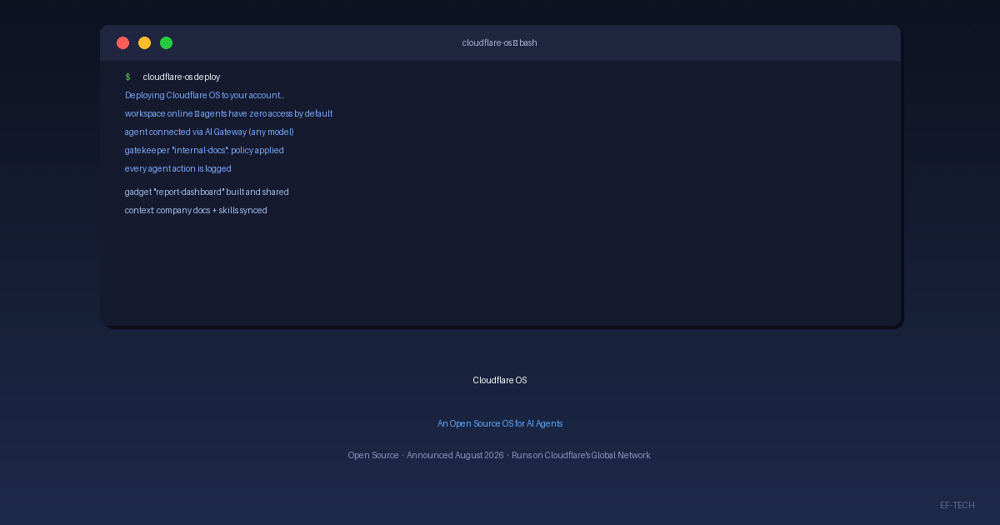

No início de agosto de 2026, a Cloudflare anunciou o **Cloudflare OS**, um "sistema operacional" open source desenhado para agentes de IA. O lançamento foi repercutido pelo canal [Código Fonte TV](https://www.youtube.com/watch?v=WwWYQ76E2C4) e detalhado no [blog oficial da Cloudflare](https://blog.cloudflare.com/cloudflare-os/).

Diferente de um sistema operacional tradicional, o Cloudflare OS não gerencia hardware: ele gerencia o que os agentes podem ver, executar e acessar dentro da sua organização — com a segurança embutida na própria arquitetura.

## O que é o Cloudflare OS

O Cloudflare OS nasceu como a plataforma interna que a própria Cloudflare usa para operar sua força de trabalho global. Milhares de funcionários — de engenharia a vendas — usam o Cloudflare OS diariamente para pesquisar, criar documentos conectados a dados ao vivo, automatizar tarefas repetitivas e construir pequenos aplicativos de trabalho.

Agora a plataforma foi open sourceada como versão 2, uma reescrita completa que qualquer organização pode implantar na própria conta Cloudflare e adaptar ao seu contexto. A ideia, nas palavras da Cloudflare, não é que sua empresa "use o Cloudflare OS", e sim que você o transforme no *sistema operacional da sua empresa*.

O acesso acontece pelo navegador, sem exigir experiência em desenvolvimento: cada colaborador ganha um agente de IA com um workspace próprio.

## Um workspace conectado à sua organização

Na prática, o Cloudflare OS funciona como uma conversa no navegador — como outras ferramentas de IA —, mas com uma diferença essencial: cada conversa é ancorada no **contexto e nas skills** que a sua organização curou.

Isso significa que o agente entende como a empresa funciona: a terminologia, os procedimentos e as melhores práticas. Quando um colaborador encontra uma forma melhor de fazer algo, esse conhecimento vira contexto e skill compartilhados — e todos se beneficiam.

O workspace também se conecta aos **sistemas internos** da organização. O agente pode consultar documentos, acessar ferramentas e trabalhar com os dados que a empresa já usa para alcançar os objetivos que recebeu, em vez de responder com conhecimento genérico.

## Componentes principais

O Cloudflare OS combina três componentes principais:

### Runtime isolado para execução de código

Agentes executam tarefas escrevendo e executando código em um **runtime isolado** (sandbox), com armazenamento próprio e dedicado. Esse código não alcança a internet nem os sistemas internos — exceto por recursos explicitamente fornecidos pela organização.

### Segurança e governança

Uma **camada de segurança e governança** controla o acesso a dados e serviços internos. O framework Gatekeepers aplica guardrails tanto a agentes quanto a aplicativos, permitindo que usuários sem perfil técnico usem a plataforma com liberdade — sem que "nada de ruim aconteça".

### Ambiente para construir e compartilhar aplicativos

Um **ambiente para aplicativos** permite que as pessoas construam, compartilhem e continuem modificando pequenos aplicativos pessoais, chamados de "gadgets". Cada aplicativo construído no Cloudflare OS ganha automaticamente uma API amigável para agentes, o que permite colaborar com a IA dentro do próprio app, sem precisar construir um servidor MCP ou integrar um loop de agente personalizado.

## Segurança Zero Trust por padrão

A segurança não é um complemento no Cloudflare OS — ela está embutida na arquitetura. Alguns princípios fundamentais:

- **Acesso Zero Trust por padrão**: construído sobre o Cloudflare Access, que verifica cada usuário e cada requisição antes de conceder qualquer acesso.
- **Agentes começam sem permissões**: um agente de IA inicia com zero permissões e recebe acesso apenas ao que é necessário para a tarefa específica.
- **Isolamento por agente**: cada agente roda em seu próprio sandbox, com armazenamento próprio. Ele não pode ler o armazenamento de outro agente.
- **Segurança baseada em capacidades**: em vez de listas de controle de acesso (ACLs), o modelo segue o princípio de capability-based security — agente é responsável perante um humano, mas tem permissões restritas próprias.

### Gatekeepers: guardiões de credenciais

O coração do modelo de segurança são os **Gatekeepers**, conectores governados que controlam o acesso a cada sistema interno. Eles detêm as credenciais, aplicam políticas, registram o que foi lido e mediam as ações dos agentes.

Na prática, o dono de cada sistema interno decide o que a IA pode ver, o que ela pode alterar e quando um humano precisa aprovar antes que uma ação seja executada. Os Gatekeepers também funcionam como MCP Server Portals, trazendo servidores MCP existentes para sob a política de Access da organização.

## Flexibilidade de modelos com o Cloudflare AI Gateway

O Cloudflare OS não é atrelado a um modelo específico. Através do **Cloudflare AI Gateway**, a plataforma funciona com qualquer modelo — e a equipe de plataforma ganha um único lugar para gerenciar roteamento e gastos.

Isso permite controlar orçamentos, definir rate limits e gerenciar a disponibilidade dos modelos, garantindo que os agentes usem a melhor opção de custo e qualidade para cada tarefa, sem depender de um único fornecedor de IA.

## Open source e pronto para sua empresa

O Cloudflare OS está disponível hoje no [GitHub](https://github.com/cloudflare/cloudflare-os) e pode ser implantado na sua própria conta Cloudflare em minutos. Como é open source e roda na sua conta, **os dados, processos e integrações continuam seus** — nada fica preso a um produto fechado de fornecedor.

A versão atual é um lançamento early access: muito capaz, mas ainda em desenvolvimento ativo. A Cloudflare já trabalha em uma opção gerenciada no dashboard, em containers para fluxos de desenvolvimento e em workspaces para Slack e outras ferramentas de chat.

## Saiba mais

- [Blog: Cloudflare OS — an open platform for agents, apps, and work](https://blog.cloudflare.com/cloudflare-os/)
- [Repositório cloudflare-os no GitHub](https://github.com/cloudflare/cloudflare-os)
- [Site oficial do Cloudflare OS](https://os.cloudflare.app/)
- [Press release da Cloudflare](https://www.cloudflare.com/press/press-releases/2026/cloudflare-os-is-the-first-ai-workspace-built-around-how-companies-actually-work/)
- [Vídeo do Código Fonte TV](https://www.youtube.com/watch?v=WwWYQ76E2C4)

---

Na **EF-TECH**, ajudamos empresas a projetar e operar cloud computing, edge e soluções de IA — incluindo a adoção de plataformas open source como o Cloudflare OS. [Entre em contato](/pt-br/contato/) para discutir como sua organização pode começar. Para mais artigos como este, visite nosso [blog](/pt-br/blog/).
