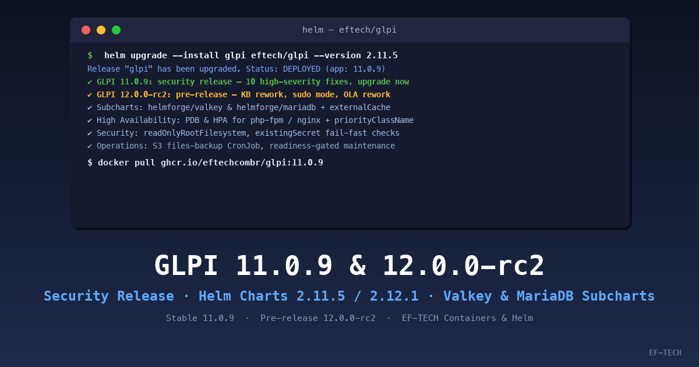

A EF-TECH publicou, em 17 de setembro de 2026, duas novas releases do projeto [eftechcombr/glpi](https://github.com/eftechcombr/glpi), que empacota o GLPI como imagens Docker (PHP-FPM + Nginx) e Helm chart para Kubernetes: **a versão estável 11.0.9 — uma release de segurança que corrige 10 vulnerabilidades de alta severidade, com atualização recomendada imediatamente — e o pré-release 12.0.0-rc2, que antecipa os recursos da próxima versão major do GLPI.**



## GLPI 11.0.9: release de segurança — atualize agora

O GLPI 11.0.9 foi publicado pelo glpi-project em 16 de setembro de 2026 e é classificado como **release de segurança**. A atualização corrige **10 vulnerabilidades de alta severidade**:

- **XSS** via importação de ilustrações de formulários;
- **XSS armazenado** em atores de chamados (tickets);
- **Bypass de MFA** por outro usuário do GLPI;
- **XSS armazenado** via nome de ativos;
- **XSS armazenado** em modelos de equipamentos de rede;
- **Upload de página maliciosa** no servidor web;
- **Injeção de SQL não autenticada** na funcionalidade de planejamento;
- **Autenticação X509 inesperada** com certificado não verificado;
- **Condição de corrida no marketplace**, permitindo a instalação de plugin malicioso;
- **Exclusão arbitrária de arquivos** durante a criação de documentos.

Além dessas, duas vulnerabilidades de severidade **média** também foram corrigidas:

- Acesso inesperado a followups, tarefas e soluções gerados a partir de templates;
- Expansão não autorizada da visibilidade de itens da base de conhecimento, lembretes e feeds RSS.

Dada a natureza das correções — incluindo injeção de SQL não autenticada e bypass de MFA —, **recomendamos que todos os ambientes em produção sejam atualizados para o 11.0.9 o quanto antes**. A release da EF-TECH entrega o GLPI 11.0.9 junto ao Helm chart `glpi-2.11.5`.

## Helm chart: o que há de novo neste ciclo

O ciclo da versão 11.0.9 consolidou uma série de melhorias estruturais no Helm chart (PRs #170–#204), herdadas também pela linha 12.x:

- **Subchart Valkey (`helmforge/valkey`)**: o Redis inline foi substituído pelo Valkey, com nova configuração `externalCache` para apontar o GLPI para clusters de cache externos gerenciados;
- **Subchart MariaDB (`helmforge/mariadb`)**: o MariaDB inline foi substituído por um subchart dedicado, e o chart agora lê a senha `MARIADB_PASSWORD` diretamente da Secret gerada pelo próprio subchart;
- **Alta disponibilidade**: suporte opcional a PodDisruptionBudget e HorizontalPodAutoscaler para `php-fpm` e `nginx` — contribuição do [@danielqb](https://github.com/danielqb), primeiro contributor externo do projeto;
- **Hardening**: suporte a `priorityClassName`, hardening opcional com `readOnlyRootFilesystem` e níveis de recursos padronizados estilo Bitnami (`resourcesPreset`);
- **Segredos**: suporte a `existingSecret` para `externalDatabase` com validação *fail-fast* em caso de configuração incorreta;
- **Confiabilidade operacional**: o CronJob de manutenção agora é condicionado à prontidão real do GLPI e do banco de dados; montagens de volume e a Secret de banco foram removidas do contêiner do Nginx;
- **Backup**: novo CronJob opcional de backup de arquivos para storage compatível com S3;
- **Organização**: os manifestos de `kubernetes/glpi` foram movidos para `helm/`, e o chart passou a ser publicado no Artifact Hub (erros de validação corrigidos).

A versão `12.0.0-rc2` do projeto ainda corrige os warnings do hadolint DL3064/DL3066 no Dockerfile do PHP.

## GLPI 12.0.0-rc2: o que vem por aí

O 12.0.0-rc2 é o segundo Release Candidate da futura versão major do GLPI, publicado upstream também em 16 de setembro de 2026. Entre os destaques do GLPI 12:

- **Reformulação da base de conhecimento** (knowledge base rework);
- **Gerenciador de sessões** (sessions manager);
- **Modo sudo**, para elevação controlada de privilégios durante a sessão;
- **Reformulação de OLA** (Operational Level Agreements);
- **Segurança reforçada** (SQL, CSRF, entre outros);
- **Avanços de acessibilidade**.

**Atenção:** por se tratar de um pré-release, o 12.0.0-rc2 **não deve ser usado em produção**. Use-o para homologação, testes de migração e validação dos novos recursos — para ambientes produtivos, a versão recomendada é a **11.0.9**. A release da EF-TECH entrega o GLPI 12.0.0-rc2 junto ao Helm chart `glpi-2.12.1`.

## Como atualizar ou experimentar

Para atualizar via Helm chart:

```bash
# Adicionar ou atualizar o repositório Helm da EF-TECH
helm repo add eftech https://eftechcombr.github.io/glpi/charts
helm repo update

# Instalar ou atualizar para a versão estável (GLPI 11.0.9)
helm upgrade --install glpi eftech/glpi \
  --namespace glpi \
  --create-namespace \
  --version 2.11.5
```

Para uso standalone com Docker:

```bash
# Estável (recomendado para produção)
docker pull ghcr.io/eftechcombr/glpi:11.0.9

# Pré-release (somente homologação/testes)
docker pull ghcr.io/eftechcombr/glpi:12.0.0-rc2
```

Links e referências:

- [Repositório EF-TECH GLPI](https://github.com/eftechcombr/glpi)
- [Releases do eftechcombr/glpi](https://github.com/eftechcombr/glpi/releases)
- [Notas da release upstream GLPI 11.0.9](https://github.com/glpi-project/glpi/releases/tag/11.0.9)
- [Notas da release upstream GLPI 12.0.0-rc2](https://github.com/glpi-project/glpi/releases/tag/12.0.0-rc2)

---

Na **EF-TECH**, somos especialistas em Kubernetes, cloud computing e automação de infraestrutura. Projetamos, implantamos e operamos ambientes GLPI de alta performance com segurança, observabilidade e escalabilidade. [Entre em contato](/pt-br/contato/) para saber como podemos ajudar sua equipe. Para mais artigos como este, visite nosso [blog](/pt-br/blog/).
